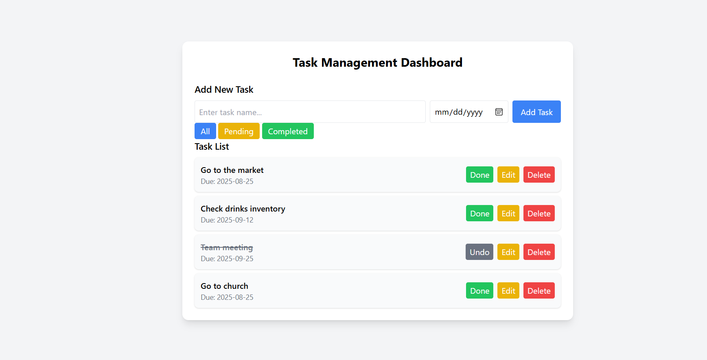

# Assignement-Task-Management-Dashboard
# Description
This Task managent dashboard is a web application that allows users to efficiently manage their daily tasks. The dashboard lets users add, edit, delete, and mark tasks as complete or pending. Tasks can be filtered by status (all, pending, completed) for better organization. The application also uses LocalStorage to save tasks so that data persists even after the browser is closed or refreshed.

# List of features Implemented
- Add task:Users can create new tasks with a name and due date.
- Delete task:Remove tasks from the list permanently.
- Update task:Edit the task name or due date.
- Toggle Completion: Mark tasks as complete or pending.
- Filter Tasks: View tasks by status – All, Pending, Completed.

- Persistent Storage: Tasks are saved in LocalStorage so they remain after page reload.

# Tools used
- HTML5: it used to create the structure of the dashboard, including the task input form, task list, and filter buttons.
- Tailwind CSS: it used for interactive functionality.
- JavaScript:it Used for styling the dashboard, giving buttons, lists, and forms a modern and responsive look and provides classes for spacing, colors, fonts, and layout without writing custom CSS.
- LocalStorage: it is browser feature used to store tasks locally so that data persists even after refreshing or closing the page.

# dashboard screenshot
https://felicite37.github.io/Assignement-Task-Management-Dashboard/

